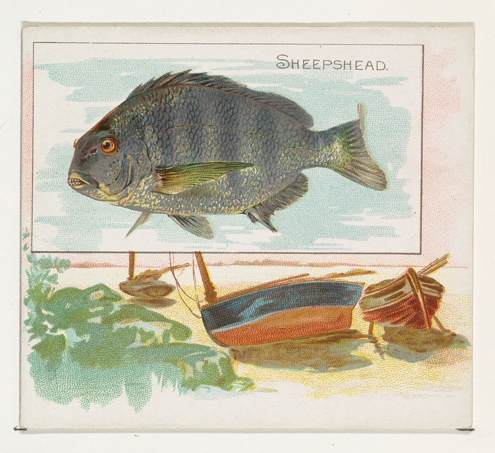

--- 
title: "Analyzing the Highlighted Art Pieces and Possible Biases at the Metropolitan Art Museum"
author: "Kate Marsh"
date: "`r Sys.Date()`"
site: bookdown::bookdown_site
---
```{r include=FALSE, cache=FALSE}
knitr::opts_chunk$set(
  echo = FALSE,
  error = TRUE, 
  fig.height = 3,
  message = FALSE,
  warning = FALSE
)
```
Final Project for Topics in Modern Statistics: Interpretable ML 

# Introduction


## Data 
       
The data I plan to use is dataset from the Metropolitan Museum of Art's collection. To use this, I plan to access the API, which can be found at this link: https://metmuseum.github.io/. I plan to use artworks that are in the Met's collection and their data to predict whether the Met deems them important. 
         
This can be done by analyzing how I can predict the "isHighlight" variable. The isHighlight variable when "true" indicates a popular and important artwork in the collection", according to the Met's API documentation. An example of one such work is Van Gogh's "Wheat Field with Cypresses". 
       
       
## The Modeling Goal 
       
The modeling goal of this project is to predict the isHighlight variable and use it to reveal biases in the Met's decision making of what is an important or non-important work. Using features such as the department of the work (eg. Egyptian Art), the culture of the art, the artist's demographics, the artist nationality, medium, dimensions, country created in, region, and general classification. 

## Models I Intend To Use 

I plan to use the following models    
* a simple OneRule model     
* decision tree     
* random forest     
* support vector machine      
* artificial neural network      

I plan to create all of these models with the intention of showing the pros and cons of interpretability. In addition, I wish to see if the different models achieve accuracy using different predictors or if they rely on the same features. 
      
I expect that the first two will be the most interpretable, while the last three will have the highest accuracy. 


<!--chapter:end:index.Rmd-->

```{r include=FALSE, cache=FALSE}
knitr::opts_chunk$set(
  echo = FALSE,
  error = TRUE, 
  fig.height = 3,
  message = FALSE,
  warning = FALSE
)
```
# OneRule

## Exploratory Analysis
```{r}

# using https://www.kaggle.com/datasets/metmuseum/the-metropolitan-museum-of-art-open-access

df <- read.csv("~/Downloads/MetObjects.csv")
#summary(df)

#colSums(is.na(df)) # this dataset has been previously cleaned, no missing values 

highlightT <- df[df$Is.Highlight == TRUE,]

```
      

```{r}
library(ggplot2)
library(plotly)
#table(df$Department)

p1 <- ggplot(df, aes(x = Department)) + 
  geom_bar() + theme_light() + theme(axis.text.x = element_text(angle = 45, size = 5, hjust=1))
ggplotly(p1)

```
      
Most of the artworks at the Met at Drawings and Prints. This makes sense becuase these are probably the easiest high medium to make! Photographs are also low effort to make and thus they are in high quantity. 

```{r}
p2 <- ggplot(df, aes(x = Is.Highlight)) + 
  geom_bar() + theme_light() + ggtitle(label = "Is the artwork a highlight?")

ggplotly(p2)

```

```{r}
p3 <- ggplot(df, aes(x = Is.Public.Domain)) + 
  geom_bar() + theme_light() + ggtitle(label = "Is the artwork in public domain?")

ggplotly(p3)
```

## Model 1

```{r}
library(OneR)

set.seed(5293)
n <- nrow(df)
train <- sample(n, .8*n)
train_dat <- df[train, ]
test_dat <- df[-train, ]

mod <- OneR(Is.Highlight ~ Classification + Country + Artist.Nationality + Artist.Display.Name + Object.Name + Department + Is.Public.Domain + Object.Date, data = train_dat)
#summary(mod)

#mean(predict(mod, train_dat) == train_dat$Is.Highlight)

#mean(predict(mod, test_dat) == test_dat$Is.Highlight)


```
      
The One Rule Model does not work for this task. The summary of the model is incredibly dense, and the "One Rule" chosen is in fact the name of the artist. For a datset of this size, it is almost impossible to interpret the model results because the model results are no better than me walking into the Met with a list of famous artists in my head. Van Gogh = Is.Highlight I would expect, and that is the case. 

```{r}

# sampling 1000 rows 

set.seed(5293)

data_s1 <- df[sample(1:nrow(df), 1000), ]
#head(data_s1)   

n <- nrow(data_s1)
train <- sample(n, .8*n)
train_dat <- data_s1[train, ]
test_dat <- data_s1[-train, ]

mod <- OneR(Is.Highlight ~ Classification + Country + Artist.Nationality + Artist.Display.Name + Object.Name + Department + Is.Public.Domain + Object.Date, data = train_dat)
#summary(mod)

mean(predict(mod, train_dat) == train_dat$Is.Highlight)

mean(predict(mod, test_dat) == test_dat$Is.Highlight)

```

      
With the oneRule model, we are able to find out that the Object.Date column is able to predict the training dataset 96% of the time; however, on the test dataset it is only able to predict 46.5% of the time. This means that the oneRule model is not very accurate, and thus we should try more models. 
      
It also tells us that 46.5% of the variation in the IsHighlight variable can be explained with the Object.Date variable in this sample. Let's see if that holds up if we use a larger sample!

```{r}

# sampling 1000 rows 

set.seed(5293)

data_s2 <- df[sample(1:nrow(df), 100000), ]
#head(data_s2)   
write.csv(data_s2, "met_data_sample_100k")

n <- nrow(data_s1)
train <- sample(n, .8*n)
train_dat <- data_s1[train, ]
test_dat <- data_s1[-train, ]

mod <- OneR(Is.Highlight ~ Classification + Country + Artist.Nationality + Artist.Display.Name + Object.Name + Department + Is.Public.Domain + Object.Date, data = train_dat)
#summary(mod)

mean(predict(mod, train_dat) == train_dat$Is.Highlight)

mean(predict(mod, test_dat) == test_dat$Is.Highlight)
```

With a dataset of 100,000 randomly selected rows, the model chooses to use the Object.Date as the explanatory variable.  
      
For this larger sample, we find that it is  able to predict the class from the object data with 96% accuracy on the training set, while it is able to predict the isHighlight variable with a 47% accuracy. 
      
While this project focuses on interpretability, it is clear that the model does not capture the nuances of the isHighlight variable and thus it is hard to trust the results. Thus, we will move onto the next option. 


```{r}
library(ggplot2)
library(waffle)

department <- head(sort(table(df$Department), decreasing = TRUE), 8)
waffle(department/1000, rows=10, size=0.6, 
       title="Art Department", 
       xlab="1 square = 1000 artworks")

period <- head(sort(table(df$Period), decreasing = TRUE), 8)
waffle(period/1000, rows=5, size=0.6, 
       title="Art Period", 
       xlab="1 square = 1000 artworks")
```
      

The period and culture variables are dominated by empty values. The department is not - something that the Met must use as a catch-all term for all different types of artworks. To fix the empty values, we will engage in basic data cleaning. 

      
Basic Data Cleaning:       
- all to lowercase      
- removed punctuation, "possibly" and "probably"       
- Removed columns with significant NA values: Period, Dynasty, Reign, Portfolio, Artist Prefix, Excavation, River, Repository, etc.       
      

```{r}
library(dplyr)
library(janitor)

#df <- read.csv("~/Downloads/MetObjects.csv")

#names(which(colSums(is.na(df)) > 0))

#df <- df[-which(df$Culture == ""),]
#df <- df[-which(df$Country == ""),]

#df1 <- df %>% select(!c(Link.Resource, Repository, Rights.and.Reproduction, Object.Number, Credit.Line, Locus,  
#                        Period, Dynasty, Reign, Portfolio,
#                        Artist.Prefix, Artist.Suffix,
#                        Locale, Excavation, River,
#                        Metadata.Date)) 

#df1 <- df1 %>%
#  rename_all(tolower) %>%
#  mutate(across(everything(), ~gsub("[^[:alnum:]]", "_", .x))) %>%
#  mutate(across(everything(), ~gsub("[[:punct:]]", "", .x))) %>%
#  mutate(across(everything(), ~gsub("&", "and", .x))) %>%
#  mutate(across(everything(), ~gsub("probably", "", .x))) %>%# for all my intents and purposes the "probably" is good enough 
#  mutate(across(everything(), ~gsub("possibly", "", .x))) # for all my intents and purposes the "probably" is good enough 

# cleaner dataset! 

#write.csv(df1, "~/Downloads/MetObjects_Cleaned.csv")

```


```{r}
#df <- read.csv("~/Downloads/MetObjects_Cleaned.csv")

#explore_true <- df[which(df$is.highlight == "True"),]
#explore_false <- df[which(df$is.highlight == "False"),]
#df_small <- explore_false[sample(1:nrow(explore_false), 1859), ]

#df2 <- rbind(explore_true, df_small)

#write.csv(df2, "~/Downloads/MetObjects_Cleaned_Small.csv")

```

## Model 1 
All variables

```{r}
library(OneR)

df <- read.csv("~/Downloads/MetObjects_Cleaned_Small.csv")

#Classification + Country + Artist.Nationality + Artist.Display.Name + Object.Name + Department + Is.Public.Domain + Object.Date + Artist.Role + Geography.Type + Region + Medium + Portfolio + Object.Begin.Date + Object.End.Date + Artist.Begin.Date + Artist.End.Date + Artist.Nationality
n <- nrow(df)
train <- sample(n, .8*n)
train_dat <- df[train, ]
test_dat <- df[-train, ]

mod2 <- OneR(is.highlight ~ ., data = train_dat)
#summary(mod2)
#plot(mod2)

print(paste0("The accuracy on the training dataset is: ",mean(predict(mod2, train_dat) == train_dat$is.highlight)))

print(paste0("The accuracy on the testing dataset is: ",mean(predict(mod2, test_dat) == test_dat$is.highlight)))

```

In this model, the One Rule is the title of the artwork, chosen from all of the possible variables in the dataset. Using the art title, we perform only a little better than random on the dataset and we perform much worse than random on the test set. This is a great example of overfitting, because the model performs significantly better on the training set than on the test set. 

## Model 2 
Only Public Domain 

```{r}
mod2 <- OneR(is.highlight ~ is.public.domain, data = train_dat)
summary(mod2)
plot(mod2)

print(paste0("The accuracy on the training dataset is: ",mean(predict(mod2, train_dat) == train_dat$is.highlight)))

print(paste0("The accuracy on the testing dataset is: ",mean(predict(mod2, test_dat) == test_dat$is.highlight)))
```
      
This model is based only on the is.public.domain variable. From this, we can tell that a large majority of artworks in the public domain are highlights (66%), compared to the large amounts of works that are not in the public domain and are not highlights (~75%).
     
As a baseline, this means that with only one variable "is.public.domain", we can achieve an accuracy of .68 on the training and test set. This is a great example where the model has not over or under-fit because they are at the same accuracy. 
     
This baseline will help us understand if the more complicated models are making a large improvement on the data or not. 
    

<!--chapter:end:model1.Rmd-->

```{r include=FALSE, cache=FALSE}
knitr::opts_chunk$set(
  echo = FALSE,
  error = TRUE, 
  fig.height = 3,
  message = FALSE,
  warning = FALSE
)
```
# Decision Tree 


## Exploratory Analysis 
Going forward, I upsampled so the "isHighlight" has an equal number of true and false values. This will make the models less computationally heavy. 

```{r}

df <- read.csv("~/Downloads/MetObjects_Cleaned_Small.csv")
```


```{r}
library(ggplot2)

ggplot(df, aes(x = n, y = department)) + 
  geom_col() + theme_light() + ggtitle(label = "Art Department") 

culture <- head(sort(table(df$culture), decreasing = TRUE), 8) 
c_df3 <- as.data.frame(culture)
ggplot(c_df3, aes(x = Freq, y = Var1)) + 
  geom_col() + theme_light() + ggtitle(label = "Art Culture, Top 8") 

```

From these plots, you can tell that the most common department in the Met Collection is Drawings and Prints, followed by Greek and Roman art, photographs, and Egyptian art. 
      
Additionally, you can tell from the second plot that the most common culture is "NA", which just means that the culture is missing. Next is American, French, and Japan. From this graph, you can also tell the data cleaning issues with the Met's data because it includes "Japan" and "Japanese" as different categories. 

```{r}
library(ggplot2)

country <- head(sort(table(df$country), decreasing = TRUE), 20) 
c2_df1 <- as.data.frame(country)
ggplot(c2_df1, aes(x = Freq, y = Var1)) + 
  geom_col() + theme_light() + ggtitle(label = "Art Country, Top 20") 

highlightT <- df[df$is.highlight == "True",]
country <- head(sort(table(highlightT$country), decreasing = TRUE), 20) 
c2_df2 <- as.data.frame(country)
ggplot(c2_df2, aes(x = Freq, y = Var1)) + 
  geom_col() + theme_light() + ggtitle(label = "Art Country, Top 20, isHighlight = TRUE") 

```
    
In these plots, we compare the frequencies of country based on whether it the artwork is a highlight or not. In both the highlight and all types graph, the most frequent country is NA, followed by Egypt. In the following countries, we can tell that the United States is under-represented in the is.Highlight = TRUE dataset, compared to the overall population. Canada and Peru are examples of other countries that follow this pattern. 
    
The opposite is true of France, which is over-represented in the highlights. Spain, Italy, and Turkey also follow the pattern of over-representation in the Highlights. 
     

## The Model 
     
To attempt to explain why some artworks are highlights and some are not, without actually looking at the painting, we are going to use a few different models. We will look at decision trees first. 

```{r}
library(rpart)
library(rpart.plot)

set.seed(151)

n <- nrow(df)

train <- sample(n, .8*n)
train_dat <- df[train, ]
test_dat <- df[-train, ]

fit <- rpart(is.highlight~., data = train_dat, method = 'class', control = rpart.control(cp = 0))
#summary(fit)
plotcp(fit)


#test_dat$pred <- predict(fit, test_dat, type = "class")
#accuracy <- mean(test_dat$pred == test_dat$ss.highlight)


#rpart.plot(fit, extra = 101) 


```
     
Prune to .17 ! This plot shows how one should prune the decision tree to have the best set of cost-complexity prunings. 

```{r}
#predict_unseen <-predict(fit, test_dat, type = 'class')
#table_mat <- table(test_dat$Is.Highlight, predict_unseen)

```

First we will fit a model that has as many decisions as we want, with very little of the pruning. 
```{r}
library(rpart)
library(rpart.plot)


fit <- rpart(is.highlight~is.public.domain + department + country + region + subregion
             + county + state + city + classification, data = train_dat, 
             method = 'class', 
             control = rpart.control(cp = .01))
fit$xlevels[["object.name"]] <- union(fit$xlevels[["object.name"]], levels(test_dat$object.name))

#summary(fit)

#test_dat$pred <- predict(fit, test_dat, type = "class")
#print(paste0("The accuracy on the testing dataset is: ",mean(test_dat$pred == test_dat$is.highlight)))


rpart.plot(fit, extra = 106, yesno = 2) 


```
        
Here is another visualization of the same decision tree. 
```{r}

split.fun <- function(x, labs, digits, varlen, faclen)
{
    # replace commas with spaces (needed for strwrap)
    labs <- gsub(",", " ", labs)
    for(i in 1:length(labs)) {
        # split labs[i] into multiple lines
        labs[i] <- paste(strwrap(labs[i], width=70), collapse="\n")
    }
    labs
}

rpart.plot::prp(fit,
    split.fun=split.fun,
    type = 2,
    yesno=2,
    clip.right.labs = FALSE,
    extra = 105, 
    under = FALSE, 
    split.cex = 2,
    under.cex = 3, 
    box.palette = "RdYlGn",
    digits = 2,
    fallen.leaves = TRUE, 
    uniform = FALSE,
    #round = 0, 
    #leaf.round= 0, 
    main = "isHighlight Type Decision Tree", 
    #cex.main = 1, 
    branch.col = "gray", 
    branch.lwd = 4, 
    faclen = 8, 
    #facsep = ",  ", 
    compress = TRUE, 
    branch.tweak = 1)
```
       
The decision tree shows that the model uses classification, department, "is public domain" and subregion of the world to determine whether the artwork is a highlight of the Metropolitan Museum of Art. Interestingly, 34% of the artworks can be excluded as "not highlights" by merely the type of art it is. If something is calligraphy, metalwork, textiles, daggers, glass, or etc., they are unlikely to be important to the Met. This is a unique finding because it shows that historic arts that were more likely to be done by women, such as textiles or basketry, are not highlighted by the Met. In accordance to what we might expect, preliminary or supporting artwork, such as drawings, stencils or photo negatives, are also deemed not a highlight. Also interesting is that then the decision tree uses departments to decide, indicating that Asian Art, Costumes, Drawings, Photographs, and Egyptian Art are less indicative of a Highlight status. Older artworks, as expected, are more likely to be highlights (according to the public domain variable). In the last two decisions, we learn that jewelry, shells, enamels, and some other classifications are unlikely to indicate being a highlight, as well as the fact that certain subregions indicate that the artwork is not highlighted. Upon investigation, these subregions are all parts of Egypt that are less famous for ruins. Compared to another subregion, such as Saqqara, which is an Ancient burial ground. 


```{r}
library(rpart)
library(rpart.plot)


fit <- rpart(is.highlight~is.public.domain + department + country + region + subregion
             + county + state + city + classification, data = train_dat, 
             method = 'class', 
             control = rpart.control(cp = .17))
fit$xlevels[["object.name"]] <- union(fit$xlevels[["object.name"]], levels(test_dat$object.name))

#summary(fit)

#test_dat$pred <- predict(fit, test_dat, type = "class")
#print(paste0("The accuracy on the testing dataset is: ",mean(test_dat$pred == test_dat$is.highlight)))


rpart.plot(fit, extra = 106, yesno = 2) 

```
```{r}

split.fun <- function(x, labs, digits, varlen, faclen)
{
    # replace commas with spaces (needed for strwrap)
    labs <- gsub(",", " ", labs)
    for(i in 1:length(labs)) {
        # split labs[i] into multiple lines
        labs[i] <- paste(strwrap(labs[i], width=80), collapse="\n")
    }
    labs
}

rpart.plot::prp(fit,
    split.fun=split.fun,
    type = 2,
    yesno=2,
    clip.right.labs = FALSE,
    extra = 105, 
    under = FALSE, 
    split.cex = 2,
    under.cex = 3, 
    box.palette = "RdYlGn",
    digits = 2,
    fallen.leaves = TRUE, 
    uniform = FALSE,
    #round = 0, 
    #leaf.round= 0, 
    main = "isHighlight Type Decision Tree", 
    #cex.main = 1, 
    branch.col = "gray", 
    branch.lwd = 4, 
    faclen = 8, 
    #facsep = ",  ", 
    compress = TRUE, 
    branch.tweak = 1)
```
       
Unfortunately, after pruning, the only decision that remains is based on the classification of the artwork. Basically, the model can tell most of the time that if it is not one of these categories, such as prints, plates, or books, that it will not be a highlight. It is able to have a .71 accuracy on the training set, which is a slight improvement from the previous OneR model, yet not a large enough improvement. 
           
Thus far, our interpretable ML has shown us that we believe that the Met is more likley to deem an artwork a highlight if it is in the public domain, and it is not one of the above categories. 

<!--chapter:end:model2.Rmd-->

```{r include=FALSE, cache=FALSE}
knitr::opts_chunk$set(
  echo = FALSE,
  error = TRUE, 
  fig.height = 3,
  message = FALSE,
  warning = FALSE
)
```
# Random Forest

## Model 1

The third model is Random Forest. This model takes decision trees and averages the outcomes of a lot of different decision trees to make the model. 

```{r}
library(caret)
library(randomForest)
library(formattable)

set.seed(151)
df <- read.csv("~/Downloads/MetObjects_Cleaned_Small.csv")

n <- nrow(df)

train <- sample(n, .8*n)
train_dat <- df[train, ]
test_dat <- df[-train, ]

table <- table(train_dat[,c('is.highlight', 'is.public.domain')])
formattable(table)
#table(train_dat[,c('is.highlight', 'department')])

set.seed(51)

train_dat$is.highlight <- as.factor(train_dat$is.highlight)
test_dat$is.highlight <- as.factor(test_dat$is.highlight)

model <- randomForest(is.highlight~is.public.domain + department + country +
                        region + subregion + county + state + city +
                        classification, 
               data = train_dat, 
               method = 'rf',
               trControl = trainControl(method = 'cv',number = 5), 
               importance = TRUE)

p1 <- predict(model, train_dat)
#caret::confusionMatrix(p1, train_dat$is.highlight)

p2 <- predict(model, test_dat)
#caret::confusionMatrix(p2, test_dat$is.highlight)

plot(model)

print(paste0("The accuracy on the training dataset is: ",mean(predict(model, train_dat) == train_dat$is.highlight)))
print(paste0("The accuracy on the testing dataset is: ",mean(predict(model, test_dat) == test_dat$is.highlight)))
```
      
The random forest model improves on the accuracy of both the decision tree and the OneR model. This model has an accuracy of .83 on the training set, and .73 on the test set. 
     
This plot shows the bounds of the MSE or error rate on the prediction for all 500 calculated trees. The red is for the lower bound, while the green is for the upper bound. 
       
## Feature Importance

```{r}
#var_imp <- varImpPlot(model,
#           sort = T,
#           n.var = 10,
#           main = "Top 10 - Variable Importance")

var.imp <- as.data.frame(model$importance)
var.imp$feature <- rownames(var.imp) 

g <- ggplot(var.imp, aes(x = feature, y=MeanDecreaseAccuracy)) + 
  theme_bw() + geom_point() + 
  theme(axis.text.x = element_text(angle=-40, hjust=.1)) + coord_flip() +
  ggtitle("Feature Importance By Mean Decrease in Accuracy")

library(plotly)

ggplotly(g)

```
       
How is random forest making these decisions? 

Using the feature importance function, which calculates the mean decrease in accuracy when a feature is permuted (randomly scrambled), we find that the department is the most important factor in whether an artwork is a highlight, followed by classification and public domain. This is different from our previous models, because they focused on public domain and classification as the major decisions up until this point. 

## Model 2

Random Forest - Smaller, Cleaned Dataset

```{r}
train_dat <- read.csv("train_dat_cleaned2.csv")
test_dat <- read.csv("test_dat_cleaned2.csv")
  
total <- rbind(train_dat, test_dat)
n <- nrow(total)
train <- sample(n, .8*n)
train_dat <- total[train, ]
test_dat <- total[-train, ]

set.seed(51)

train_dat <- train_dat %>% select(-c(X.2, X))
test_dat <- test_dat %>% select(-c(X.2, X))
train_dat$is.highlightTrue <- as.factor(train_dat$is.highlightTrue)
test_dat$is.highlightTrue <- as.factor(test_dat$is.highlightTrue)

model <- randomForest(is.highlightTrue~., 
               data = train_dat, 
               method = 'rf',
               trControl = trainControl(method = 'cv',number = 5), 
               importance = TRUE)

p1 <- predict(model, train_dat)
#caret::confusionMatrix(p1, train_dat$is.highlight)

p2 <- predict(model, test_dat)
#caret::confusionMatrix(p2, test_dat$is.highlight)

print(paste0("The accuracy on the training dataset is: ",mean(predict(model, train_dat) == train_dat$is.highlight)))
print(paste0("The accuracy on the testing dataset is: ",mean(predict(model, test_dat) == test_dat$is.highlight)))

```

## LIME
```{r message=FALSE}
library("DALEXtra")
library("lime")
#train_dat <- read.csv("train_dat_cleaned.csv")
#test_dat <- read.csv("test_dat_cleaned.csv")

#train_dat$is.highlightTrue <- as.numeric(train_dat$is.highlightTrue)-1
#test_dat$is.highlightTrue <- as.numeric(test_dat$is.highlightTrue)-1

x_train <- train_dat[, -which(names(train_dat) == "is.highlightTrue")]
y_train <- train_dat$is.highlightTrue
x_test <- test_dat[, -which(names(test_dat) == "is.highlightTrue")]
y_test <- test_dat$is.highlightTrue

model_type.dalex_explainer <- DALEXtra::model_type.dalex_explainer
predict_model.dalex_explainer <- DALEXtra::predict_model.dalex_explainer

rf_exp <- DALEX::explain(model = model,  
                        data = x_train,
                        y = y_train, 
                        label = "Random Forest", verbose = FALSE)

rf_lime <- predict_surrogate(explainer = rf_exp, 
                  new_observation = x_test[4:5,], 
                  n_features = 10, 
                  n_permutations = 1000,
                  type = "lime",
                  predict = predict.randomForest,
                  verbose = FALSE, 
                  bin_continuous = TRUE, 
                  quantile_bins = FALSE,
                  #n_labels     = 1,
                  kernel_width = 0.5)
plot(rf_lime)

```


```{r}
#test_dat[4,]$object.id
#df[which(df$object.id == "2408"),]
knitr::include_graphics("object.id2408.jpeg", fig.align="center")
```
      
The description of this artpiece is as follows: This is one of a small group of distinctive vessels from the Central Piedmont region of North Carolina. With its exuberant slip decoration and ample size, it is one of the finest of the known surviving pots from that area


```{r}
#test_dat[5,]$object.id
#df[which(df$object.id == "314397"),]
knitr::include_graphics("object.id314397.png", fig.align="center")
```
            
       
The description of this artwork is as follows: Baule peoples and their neighbors to the West, the Guro, are famous as weavers, and are known for their fine indigo-and-white cotton fabrics. Used on the traditional narrow-band loom, heddle pulleys are functional objects used to ease the movements of the heddles while separating the warp threads and allowing the shuttle to seamlessly pass through the layers of thread. Like many other carved objects used in everyday activities among the Baule, these pulleys were often embellished for the weaver’s delight. Scholars have suggested that the prominent display of pulleys, hanging over the weaver’s loom in the public place, afforded artists their best opportunity to showcase their carving skills, in the hope to attract commissions for figures and masks. This example, distinctive for its Janus representation and conical hairdos, demonstrates the efforts put by Baule carvers into beautifying the simplest functional object.
      
      
It is interesting to compare these two artworks. The first, the American sugarpot, is a highlight, while the second, the Baule sculpture are both old, sculpted works in the Met collection. Both of these artworks do not have a value for the city and unknown artists. The major aspect of the classification that differs between these works, as we can tell from the LIME graphs, is the age. The first artwork is made in the 1820s-1840s, yet the second has a much larger range of time it could've been made in: from 1800 to 2000. 
      
 
While this does not directly show a discrimination based on region, such as American art vs African art, it definitely shows a discrimination based on perceived age and range of age. This is interesting because societies with less specific record-keeping of art age or where the Met cannot tell the age might be a predictor of the artwork not being a highlight. 

      
References:     
- https://www.r-bloggers.com/2021/04/random-forest-in-r/    
- https://stats.stackexchange.com/questions/493714/random-forest-variable-importance-plot-discrepancy

<!--chapter:end:model3.Rmd-->

```{r include=FALSE, cache=FALSE}
knitr::opts_chunk$set(
  echo = FALSE,
  error = TRUE, 
  fig.height = 3,
  message = FALSE,
  warning = FALSE
)
```
# Support Vector Machine 
      
In order to do the next two models, the data needed to be processed differently to account for the categories that appear in the training set and not the test set, or vice versa.        
            
      
```{r}
library(e1071)
library(dplyr)
library(caret)
str = "Ábcdêãçoàúü"
str = iconv(str, from = '', to = 'ASCII//TRANSLIT')
#gsub("[[:punct:]]", "", str)

remove_exotic <- function(str){
  str = iconv(str, from = '', to = 'ASCII//TRANSLIT')
  return(gsub("[[:punct:]]", "", str))
}
```

## The Model

```{r include = FALSE, eval = FALSE}

df <- read.csv("~/Downloads/MetObjects_Cleaned_Small.csv")

n <- nrow(df)

train <- sample(n, .8*n)
train_dat <- df[train, ]
test_dat <- df[-train, ]

train_dat2 <- train_dat %>% select(c(is.highlight, is.public.domain, department, country, region, subregion,state, city, classification)) 
test_dat2 <- test_dat %>% select(c(is.highlight, is.public.domain, department, country, region, subregion,state, city, classification)) 

train_dat2$is.highlight <- as.factor(train_dat2$is.highlight)
test_dat2$is.highlight <- as.factor(test_dat2$is.highlight)


td3 <- na.omit(train_dat2)
testd3 <- na.omit(test_dat2)

td3$city <- sapply(td3$city,remove_exotic)
testd3$city <- sapply(testd3$city,remove_exotic)
td3$state <- sapply(td3$state,remove_exotic)
testd3$state <- sapply(testd3$state,remove_exotic)
td3$region <- sapply(td3$region,remove_exotic)
testd3$region <- sapply(testd3$region,remove_exotic)
td3$subregion <- sapply(td3$subregion,remove_exotic)
testd3$subregion <- sapply(testd3$subregion,remove_exotic)

td3 <- as.data.frame(td3)
testd3 <- as.data.frame(testd3)

svm_model<- svm(is.highlight~is.public.domain + department + country +
                        region + subregion + state + city +
                        classification, 
                data = td3, 
                type = "C-classification",
                test_datadecision.values=TRUE,
                kernel = "linear")

#pred_train <- predict(svm_model, td3, decision.values = T)
#mean(pred_train == td3$is.highlight)

#pred_test <- predict(svm_model, testd3, decision.values = T)
#mean(pred_test == testd3$is.highlight)

```


```{r include = FALSE, eval = FALSE}
n <- nrow(df)

df$city <- sapply(df$city,remove_exotic)
df$state <- sapply(df$state,remove_exotic)
df$region <- sapply(df$region,remove_exotic)
df$subregion <- sapply(df$subregion,remove_exotic)

#dummy <- dummyVars(" ~ .", data=df)
#newdata <- data.frame(predict(dummy, newdata = df))

#write.csv(newdata, "dummyvars.csv")

```

```{r}
library(mikropml)
library(dplyr)

#df <- read.csv("~/Downloads/MetObjects_Cleaned_Small.csv")

#getting rid of columns with near-zero variance 
#newdata <- read.csv("~/Desktop/dummyvars.csv")
#newdata[,"is.highlightFalse"] <- as.character(newdata[,"is.highlightFalse"])
#dat_proc <- preprocess_data(newdata, 'is.highlightTrue')$dat_transformed

#dat_proc <- dat_proc %>% select(-c(is.highlightFalse_1))
#dat_proc$object.id = df$object.id #adding ID column back into dataset after processing

#n <- nrow(dat_proc)
#train <- sample(n, .8*n)
#train_dat_proc <- dat_proc[train, ]
#test_dat_proc <- dat_proc[-train, ]

#write.csv(train_dat_proc, "train_dat_cleaned2.csv")
#write.csv(test_dat_proc, "test_dat_cleaned2.csv")

train_dat <- read.csv("train_dat_cleaned2.csv")
test_dat <- read.csv("test_dat_cleaned2.csv")
  
total <- rbind(train_dat, test_dat)
n <- nrow(total)
train <- sample(n, .8*n)
train_dat <- total[train, ]
test_dat <- total[-train, ]

svm_model<- svm(is.highlightTrue~. -object.id, 
                data = train_dat, 
                type = "C-classification",
                test_datadecision.values=TRUE,
                kernel = "polynomial", 
                scale = FALSE)

pred_train <- predict(svm_model, train_dat, decision.values = T)
print(paste0("The accuracy on the training dataset is: ",mean(pred_train == train_dat$is.highlightTrue)))

pred_test <- predict(svm_model, test_dat, decision.values = T)
print(paste0("The accuracy on the testing dataset is: ",mean(pred_test == test_dat$is.highlightTrue)))
```
The support vector machine is a major improvement on the accuracy of the model. This model has an accuracy of .94 on the training set and .92 on the test set. This shows that the model is probably not over or underfitting very heavily and has a high accuracy. 

## Visualization

```{r}
library(ggplot2)

train_dat$is.highlight <- as.factor(train_dat$is.highlight) 
scatter_plot <- ggplot(data = train_dat, 
                       aes(x = object.end.date, 
                           y = object.begin.date, color = is.highlight))+   
  geom_point() +   
  scale_color_manual(values = c("red", "blue"))

layered_plot <- 
    scatter_plot + geom_point(data = train_dat[svm_model$index, ], 
                              aes(x = object.end.date, y = object.begin.date), 
                              color = "purple", 
                              size = 4, alpha = 0.5)

#display plot

library(plotly)

ggplotly(layered_plot)

```
      
While SVM is the most accurate model by far, it is very difficult to conduct interpretable ML methods on this model. Even the basic visualizations that are suggested in a lot of tutorials are not easy to do with this dataset, as can be seen in the graph above (you cannot see any information with two binary variables graphs in this manner)! SVM uses hyperplanes and thus visualizations are inherently difficult because it is unclear how one would visualize a multi-dimensional space greater than 3 dimensions. The above graph shows the "decision boundary" that the SVM uses in purple, yet it is difficult to understand what that decision boundary means in two dimensions, because the graph does not appear to truly be split by the line the purple dots create. In simpler terms, the red and blue dots are on both sides.     

     
Through using the SVM, I aim to demonstrate that accuracy, as a metric can often be misleading. It is unclear how good this model is if we are unable to figure out why it is making the decisions it is making. For the purposes of this project, which aims to determine the decision-making process that goes into the selection of the IsHighlight variable, this model is useless. It does not tell us which features contributed to the predictions it made or the the importance of those features. 

```{r}
#newdata <- read.csv("~/Desktop/dummyvars.csv")
#newdata[,"is.highlightFalse"] <- as.character(newdata[,"is.highlightFalse"])
#dat_proc <- preprocess_data(newdata, 'is.highlightTrue')
#dat_proc$grp_feats$grp1 
#dat_proc$grp_feats$grp2 
#dat_proc$grp_feats$grp3
#dat_proc$removed_feats

```
     
Note:       
    
What are grp1, grp2, and grp 3?       
       
The pre-processing package I used collapses perfectly correlated features. These groups are sets of perfectly correlated features. grp1 is the index column and the object number. grp2 is the title of the artist and their name. grp3 is whether the public domain is true and whether it is false. All of these columns are removed and placed into these groups. For all intents and purposes, I deemed these columns un-necessary and removed them. 
     
Reference:       
- https://rpubs.com/cliex159/865583      
- https://web.mit.edu/6.034/wwwbob/svm.pdf       
- https://github.com/SchlossLab/mikRopML/issues/156      

<!--chapter:end:model4.Rmd-->

```{r include=FALSE, cache=FALSE}
knitr::opts_chunk$set(
  echo = FALSE,
  error = TRUE, 
  fig.height = 3,
  message = FALSE,
  warning = FALSE
)
```
# Neural Network

Lastly, I conducted a neural network.

## The Model 
      
This neural network has three different layers, an Adam optimizer, 50 epochs, and a batch size of 5. 
```{r message=FALSE}
library(keras)
library(dplyr)
train_dat <- read.csv("train_dat_cleaned2.csv")
test_dat <- read.csv("test_dat_cleaned2.csv")

train_dat2 <- train_dat %>% select(-c(X.2, grp1, grp2, grp3, X, object.id))
test_dat2 <- test_dat %>% select(-c(X.2, grp1, grp2, grp3, X, object.id))

x_train <- as.matrix(train_dat2[, -which(names(train_dat2) == "is.highlightTrue")])
y_train <- as.matrix(train_dat2$is.highlightTrue)
x_test <- as.matrix(test_dat2[, -which(names(test_dat2) == "is.highlightTrue")])
y_test <- as.matrix(test_dat2$is.highlightTrue)

# Define the model architecture
model <- keras_model_sequential() %>% 
  layer_dense(units = 64, activation = "relu", input_shape = ncol(x_train)) %>% 
  layer_dense(units = 32, activation = "relu") %>% 
  layer_dense(units = 1, activation = "sigmoid")

# Compile the model with a loss function, optimizer, and metric
history <- model %>% compile(
  loss = "binary_crossentropy",
  optimizer = "adam",
  metrics = c("accuracy")
)

# Train the model on the training data
model %>% fit(
  x_train, y_train,
  validation_split = 0.2,
  epochs = 50,
  batch_size = 5
)


# Evaluate the model on the test data
metrics <- model %>% evaluate(x_test, y_test)

# Print the test accuracy
tr_metrics <- model %>% evaluate(x_train, y_train)

cat("Train accuracy:", tr_metrics["accuracy"], "\n")
cat("Test accuracy:", metrics["accuracy"], "\n")
```

The neural network, in this un-optimized form, did not result in a improvement in accuracy from the SVM. It performed very similarly to the random forest model in the training sets, yet the neural network did a much better job on the test set, compared to .72 on the test set for the random forest model. 

## Shapley Values

To interpret this model, we will use Shapley Values: 

According to "9.6 SHAP (SHapley Additive exPlanations)" from our IML textbook (https://christophm.github.io/interpretable-ml-book/shap.html): 
      Shapley values are "The Shapley value, coined by Shapley (1953), is a method for assigning payouts to players depending on their contribution to the total payout. Players cooperate in a coalition and receive a certain profit from this cooperation". The math for SHAP is as follows: g(z')=\phi_0+\sum_{j=1}^M\phi_jz_j' where where g is the explanation model, z'\in\{0,1\}^M is the coalition vector, M is the maximum coalition size and \phi_j\in\mathbb{R} is the feature attribution for a feature j, the Shapley values. 

         
### Shapley Values for One Artwork
In this graph, we can see what is most important to the first artwork. 


```{r message=FALSE}
library(iml)
library(keras)

set.seed(2244)

shap_train <- train_dat2[, -which(names(train_dat2) == "is.highlightTrue")]
shap_test <- test_dat2[, -which(names(test_dat2) == "is.highlightTrue")]


mod <- Predictor$new(model, data = shap_train)
x.interest <- shap_test[1,]
shapley <- Shapley$new(mod, x.interest = x.interest)
plot(shapley, sort = TRUE)

```
      
The value of a shapley value is the average contribution of a feature value to the prediction in different coalitions. 
      
From this graph, we can tell the most important features in the determination of whether the first artwork in the test set is a highlight or not. This feature had a country, city, and dimensions. All of these factors helped the model determine the outcome. It did not have an artist bio, but it did not have geography.type. These factors contradicted the outcome. 

Spoiler! This artwork is a highlight. This means that for this artwork, it supported the models conclusion of a highlight because it had a value for a country, city, and dimensions. It hurt that conclusion when it had a value for the geography type and it did not have an artist bio. 
     
This makes a lot of sense. From this we can tell that the Met has much more extensive data on the highlighted works and their artists. This is unsurprising. The most famous artists in the Met are likely more well-studied and their data is referenced more often and, therefore, must be cleaner. 


        
### Full Test Set 

```{r message=FALSE}
library(iml)

mod <- Predictor$new(model, data = shap_train)
x.interest <- shap_test[c(1:744),]
shapley <- Shapley$new(mod, x.interest = x.interest)
shap_plot <- plot(shapley)

ggplotly(shap_plot)

```
          
This graph shows an average of the shapley values for all of the test set.      
      
Interestingly, we can see what makes something more likely to be a highlight in the test set by the following qualities:       
- it is not in the Asian Art department       
- it is oil on canvas       
- it is not a print       
- it is not made by a French or American person      
      
It is less likely to be a highlight because of these qualities:       
- it is not in the drawings and prints department       
- it doesn't have a country of origin, classification, or city listed      
- it is not in the costume institute       
- it has no nationality listed      
- it is not in the Egyptian Art, Costume Institute, European Decorative/Sculptural arts, or photographs department      
- it is not a photograph or a painting      
     
That is a lot of double negatives! Whew!       
In summary, it is more likely to be a highlight if it is not in the Asian Art department, it is oil on canvas, it has a stated culture, it is a painting, it has a nationality, it is not a print, and it was not made by a French or American person.       

        
```{r message=FALSE, out.width="95%"}
library(lime)

## works!
model_type.keras.engine.sequential.Sequential <- function(x, ...) {
  "classification"
}
predict_model.keras.engine.sequential.Sequential <- function (x, newdata, type, ...) {
  pred <- predict(object = x, x = as.matrix(newdata))
  data.frame (Positive = pred, Negative = 1 - pred) }

predict <- predict_model(x = model, 
               newdata = x_test, 
               type = 'raw') %>%
  tibble::as_tibble()

explainer <- lime::lime(x = as_tibble(x_train), 
                         model= model, 
                         bin_continuous = FALSE)

explanation <- lime::explain (
    as_tibble(x_test[c(2,366), ]), # Just to show first 10 cases
    explainer = explainer, 
    n_labels = 1,
    #labels    =  y_test[c(1,366), ], # explaining a `single class`(Polarity)
    n_features   = 10, # returns top 10 features critical to each case
    kernel_width = 0.5) 

plot_features(explanation) +
  labs (title = "LIME: Feature Importance Visualization",
        subtitle = "Hold Out (Test) Set, Object 200 and Object 322890")

```
      
In this LIME plot, we can inspect the ways that certain columns can impact the label of "positive" or "negative." For the first plot, we look at the first artwork in the test set. We can tell lack of the classification "Drawings and Prints" supports that it is a highlight. We actually already knew this from the Decision Tree. Having dimensions which this artwork does have, contradicts the fact that it is a highlight. Some objects, such as clothing pieces, do not have dimensions. 
    
Secondly, we see that a classification is a major feature in its importance. This makes sense because the Met probably has clean data for Van Goghs and Rembrandts and easily classified wroks might have made the category of work that it belongs in. 
      
Interestingly, the feature of Asian Art and Egyptian Art, as departments, did not support this label. Possibly because it is biased against Asian Art and towards Egyptian art. For case 2, we also found that "Drawings and prints" has a major effect, followed by dimensions, classification, photographs, drawings, Asian Art, and artist role. 
      
      
It feels wrong to talk about these art pieces without looking at them. So what artwork is the first one in the left lime explanation?        
```{r message=FALSE}
#test_dat[2,]$object.id
#df[which(df$object.id == "1083"),]
knitr::include_graphics("object.id1083.jpeg", fig.align="center")
```
      
Yes, that's right! Daniel Pabst's cabinet.       
For reference, the website description continues as follows: "This Modern Gothic cabinet superbly demonstrates the influence of British reform theory on American design in the late nineteenth century. In form and decoration, it is indebted to the British architect Bruce J. Talbert, whose book "Gothic Forms Applied to Furniture, Metal Work, and Decoration for Domestic Purposes" (Birmingham, 1867; Boston, 1873) was influential in this country. A kinship with the work of the Philadelphia architect Frank Furness is also evident in the overall form of the cabinet, the verticality and shingled "roof" of which somewhat resemble Furness's bank buildings of the 1870s. The reverse-painted ribbed-glass panels are of a type Furness began to use on buildings as architectural decoration in 1876. Their stylized floral motif recalls the geometric plant forms of Christopher Dresser, a leading English ornamentist of the period who visited the Centennial Exhibition in Philadelphia in 1876 and whose published designs were well known in this country. Daniel Pabst, a leading manufacturer of artistic furniture in Philadelphia, probably executed the cabinet. A related cabinet, now in the Brooklyn Museum of Art, is documented to Pabst." 
        

```{r message=FALSE}
#test_dat[366,]$object.id
#df[which(df$object.id == "420178"),]


```
      
This object, which is not a highlight is a "Trade card from the "Fish from American Waters" series (N39), issued in 1889 in a set of 50 cards to promote Allen & Ginter brand cigarettes," according to the Met description. The first thing in the LIME explanation that contributes to its correct "non-highlight" classification is the fact that it is a drawing/print. 


```{r message=FALSE}
set.seed(2244)
vec <- sample(1:744, 20, replace = FALSE)

explanation <- lime::explain (
    as_tibble(x_test[vec, ]), # Just to show first 10 cases
    explainer    = explainer, 
    n_labels     = 1, # explaining a `single class`(Polarity)
    n_features   = 39, # returns top 10 features critical to each case
    kernel_width = 0.5) 

plot_explanations (explanation) +
  labs (title = "LIME Feature Importance Heatmap",
        subtitle = "Hold Out (Test) Set, 20 Random Cases Shown")
```
       
As a reminder, blue in the above graph means that the feature supports the above classification, while red means it contradicts the classification.             
      
From this explanations graph, we can see a combination of important of features based on feature weights from 20 random cases from the test set. 
- We can tell that classification as Drawings and Prints hurts the artwork;s chances of being a highlight.       
- We can also tell that a lack of dimensions or artist bio negatively affect the probability of the artwork being a highlight.       
- We also found that being in the Asian Art department or Egyptian Art department negatively affects the artwork's chance of being a highlight.       
- The only features that support the positivity of the "Highlight" variable are that the artist's role is "artist" and that the classification column is empty.       
      
         
Interestingly, the only departments that lack classification are the libraries, CostumeInstitute, and Egyptian Art. If we delineate by is.Highlight it makes a lot of sense to use an empty classification as a predictor because in all cases of empty classification, the libraries collection is a highlight. 
```{r message=FALSE}
table(df[which(df$classification == ""),]$department, df[which(df$classification == ""),]$is.highlight)
```

```{r message=FALSE}
empty_class <- df[which(df$classification == ""),]
#empty_class[which(empty_class$department == "TheLibraries"),]$title[3]
knitr::include_graphics("object.idbook.jpeg", fig.align="center")
```
From a Met archive search, these appear to be illustrations and other types of art in books. In the end, this lack of classification is likely a data error that merely needs to be resolved in the met archive.      


References:       
- https://rstudio-pubs-static.s3.amazonaws.com/351198_33fe919a0364428bba3c848f4358fd5e.html      


<!--chapter:end:model5.Rmd-->

```{r include=FALSE, cache=FALSE}
knitr::opts_chunk$set(
  echo = FALSE,
  error = TRUE, 
  fig.height = 3,
  message = FALSE,
  warning = FALSE
)
```
# Reflections
       
       
## Model Conclusions
In conclusion, I found that different models, especially SVM could predict whether something was a highlight with .96 accuracy on both the training and test set based on only 40 characteristics.        
     
Unfortunately, as our least interpretable model, SVM did not show us what we truly wanted to know. What characteristics of an artwork does the Met use to characterize whether something is a highlight of the collection or not? 
            
To answer this question, I began with the OneRule model. The oneRule model showed us that part of the answer to this question is whether the artwork is in the public domain. If the artwork is in the public domain, it is more likely to be a highlight. This variable is likely a proxy for age, which was not otherwise in the dataset due to data cleaning challenges. 
            
Next, I explored the data with a decision tree. From the decision tree, we were able to understand that classification is important in the decision making process. Items classified as jade, daggers, negatives, basketry, and more are just simply less likely to be a highlight than the other options. Unfortunately, after pruning, the model did not tell us really any more information. 
              
After decision trees, I modeled the data with random forest. From the feature importance function, we were able to find that the department was the most important feature, followed by the public domain, classification, and country. This gave us more understanding of how the features affect the outcome. In addition, we used LIME to compare two different artworks, one from the United States and one from Cote d'Ivoire. These artworks, while similar in characteristics, age, and make, had very different ranges in time-frame. The LIME explanation showed that how big the range in between these two dates are (the guesses for beginning object date and ending object date) was the most important feature to help the model predict if the artworks were a highlight. I theorized that artworks from Western cultures might be more likely to have a specific date, or a smaller range of dates, attached to that artwork and thus that might be a proxy for Western art. 
             
Our last interpretable method was the neural network. For this model, I used both shapley values and LIME to determine why the model was making its decisions. From that I was able to find the following biases.  
               
These are all features that make something more likely to be a highlight: 
- not being in the Asian Art or Drawings and Prints department        
- being in the following departments: Egyptian Art, Greek and Roman Art, Costume Institute, European Sculptural/Decorative Arts, and Photographs        
- not being made by a French or American person.        
- having no listed country of origin, nationality, classification, or city       
- being a photograph or a painting        
- being oil on canvas       
- not being a print       
    
           
## Final Thoughts
From the interpretation of these models, I found that the Met collection has a few characteristics that it looks for when it determines a highlight. In contrast to the Met's highlight variable being purely about the quality of the artwork and its value or aesthetics, I was able to find a non-quality variables that have a large influence on how the Met decides its highlights. 
        
It appears from this analysis, that the Met is biased towards art that upholds the myth of Western civilization. In popular culture, the "West" begins with the Greek and Romans, following with the Egyptians, then European neo-classicism and the United States. The United States's neoclassical architecture in the U.S. Capitol and on university campuses as a signal of greatness is a good example of the continuing myth of the West and its lasting impact on American society. Columbia University's campus, with its Butler library inscribed with Greek and European authors, is a project in symbolizing greatness by its proximity to Western civilization. 

One specific counter to this argument is that the Met biases against paintings made by French and American artists for the highlight label, but it is important to note that these are the largest categories of artists and make up 20% of the collection and 22% of the highlights, so any bias is likely negligible. 
      
We can see this myth of greatness appear again in the "highlights" of the Met collection. We have shown biases towards certain departments, especially Egyptian art, Greek and Roman art, and European Sculptural/Decorative arts. We have shown biases against Asian art. We have shown biases towards Western art mediums, such as oil on canvas. We found that more accurate years can signify being a highlight. The legacy of colonization, which often resulted in destroyed records, affects the ability of the Met and even the places where the art is from to track the exact year of an artwork. 
       
While the Met's highlights may be based on multiple factors, including quality and historical significance, it is apparent that there are non-quality variables that play a large role in their decision-making process. The biases towards art that upholds the myth of Western civilization, as well as certain departments and mediums, suggest a need for greater diversity and inclusion in the Met's collection, especially among the "highlighted" works. 

<!--chapter:end:reflections.Rmd-->

