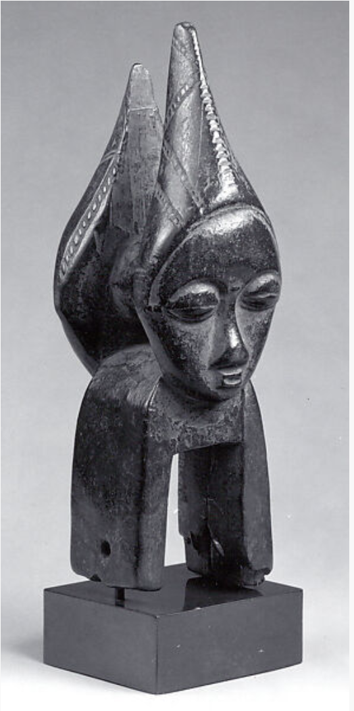

# [Random Forest]


## Random Forest

The third model is Random Forest. This model takes decision trees and averages the outcomes of a lot of different decision trees to make the model. 

```{r}
library(caret)
library(randomForest)
library(formattable)

set.seed(151)
df <- read.csv("~/Downloads/MetObjects_Cleaned_Small.csv")

n <- nrow(df)

train <- sample(n, .8*n)
train_dat <- df[train, ]
test_dat <- df[-train, ]

table <- table(train_dat[,c('is.highlight', 'is.public.domain')])
formattable(table)
#table(train_dat[,c('is.highlight', 'department')])

set.seed(51)

train_dat$is.highlight <- as.factor(train_dat$is.highlight)
test_dat$is.highlight <- as.factor(test_dat$is.highlight)

model <- randomForest(is.highlight~is.public.domain + department + country +
                        region + subregion + county + state + city +
                        classification, 
               data = train_dat, 
               method = 'rf',
               trControl = trainControl(method = 'cv',number = 5), 
               importance = TRUE)

p1 <- predict(model, train_dat)
#caret::confusionMatrix(p1, train_dat$is.highlight)

p2 <- predict(model, test_dat)
#caret::confusionMatrix(p2, test_dat$is.highlight)

plot(model)

print(paste0("The accuracy on the training dataset is: ",mean(predict(model, train_dat) == train_dat$is.highlight)))
print(paste0("The accuracy on the testing dataset is: ",mean(predict(model, test_dat) == test_dat$is.highlight)))
```

The random forest model improves on the accuracy of both the decision tree and the OneR model. This model has an accuracy of .83 on the training set, and .73 on the test set. 

```{r}
#var_imp <- varImpPlot(model,
#           sort = T,
#           n.var = 10,
#           main = "Top 10 - Variable Importance")

var.imp <- as.data.frame(model$importance)
var.imp$feature <- rownames(var.imp) 

g <- ggplot(var.imp, aes(x = feature, y=MeanDecreaseAccuracy)) + 
  theme_bw() + geom_point() + 
  theme(axis.text.x = element_text(angle=-40, hjust=.1)) + coord_flip() +
  ggtitle("Feature Importance By Mean Decrease in Accuracy")

library(plotly)

ggplotly(g)

```
How is random forest making these decisions? 

Using the feature importance function, which calculates the mean decrease in accuracy when a feature is permuted (randomly scrambled), we find that the department is the most important factor in whether an artwork is a highlight, followed by classification and public domain. This is different from our previous models, because they focused on public domain and classification as the major decisions up until this point. 


Random Forest - Smaller, Cleaned Dataset

```{r}
train_dat <- read.csv("train_dat_cleaned2.csv")
test_dat <- read.csv("test_dat_cleaned2.csv")
  
total <- rbind(train_dat, test_dat)
n <- nrow(total)
train <- sample(n, .8*n)
train_dat <- total[train, ]
test_dat <- total[-train, ]

set.seed(51)

train_dat <- train_dat %>% select(-c(X.2, grp1, grp2, grp3, X, object.id))
test_dat <- test_dat %>% select(-c(X.2, grp1, grp2, grp3, X, object.id))
train_dat$is.highlightTrue <- as.factor(train_dat$is.highlightTrue)
test_dat$is.highlightTrue <- as.factor(test_dat$is.highlightTrue)

model <- randomForest(is.highlightTrue~., 
               data = train_dat, 
               method = 'rf',
               trControl = trainControl(method = 'cv',number = 5), 
               importance = TRUE)

p1 <- predict(model, train_dat)
#caret::confusionMatrix(p1, train_dat$is.highlight)

p2 <- predict(model, test_dat)
#caret::confusionMatrix(p2, test_dat$is.highlight)

print(paste0("The accuracy on the training dataset is: ",mean(predict(model, train_dat) == train_dat$is.highlight)))
print(paste0("The accuracy on the testing dataset is: ",mean(predict(model, test_dat) == test_dat$is.highlight)))

```


```{r}
library("DALEXtra")
library("lime")
#train_dat <- read.csv("train_dat_cleaned.csv")
#test_dat <- read.csv("test_dat_cleaned.csv")

#train_dat$is.highlightTrue <- as.numeric(train_dat$is.highlightTrue)-1
#test_dat$is.highlightTrue <- as.numeric(test_dat$is.highlightTrue)-1

x_train <- train_dat[, -which(names(train_dat2) == "is.highlightTrue")]
y_train <- train_dat$is.highlightTrue
x_test <- test_dat[, -which(names(test_dat2) == "is.highlightTrue")]
y_test <- test_dat$is.highlightTrue

model_type.dalex_explainer <- DALEXtra::model_type.dalex_explainer
predict_model.dalex_explainer <- DALEXtra::predict_model.dalex_explainer

rf_exp <- DALEX::explain(model = model,  
                        data = x_train,
                        y = y_train, 
                        label = "Random Forest", verbose = FALSE)

rf_lime <- predict_surrogate(explainer = rf_exp, 
                  new_observation = x_test[4:5,], 
                  n_features = 10, 
                  n_permutations = 1000,
                  type = "lime",
                  predict = predict.randomForest,
                  verbose = FALSE, 
                  bin_continuous = TRUE, 
                  quantile_bins = FALSE,
                  #n_labels     = 1,
                  kernel_width = 0.5)
plot(rf_lime)

```


```{r}
test_dat[4,]$object.id
df[which(df$object.id == "2408"),]
knitr::include_graphics("object.id2408.jpeg")
```
The description of this artpiece is as follows: This is one of a small group of distinctive vessels from the Central Piedmont region of North Carolina. With its exuberant slip decoration and ample size, it is one of the finest of the known surviving pots from that area


```{r}
test_dat[5,]$object.id
df[which(df$object.id == "314397"),]

```
            
The description of this artwork is as follows: Baule peoples and their neighbors to the West, the Guro, are famous as weavers, and are known for their fine indigo-and-white cotton fabrics. Used on the traditional narrow-band loom, heddle pulleys are functional objects used to ease the movements of the heddles while separating the warp threads and allowing the shuttle to seamlessly pass through the layers of thread. Like many other carved objects used in everyday activities among the Baule, these pulleys were often embellished for the weaver’s delight. Scholars have suggested that the prominent display of pulleys, hanging over the weaver’s loom in the public place, afforded artists their best opportunity to showcase their carving skills, in the hope to attract commissions for figures and masks. This example, distinctive for its Janus representation and conical hairdos, demonstrates the efforts put by Baule carvers into beautifying the simplest functional object.
      
      
It is interesting to compare these two artworks. The first, the American sugarpot, is a highlight, while the second, the Baule sculpture are both old, sculpted works in the Met collection. Both of these artworks do not have a value for the city and unknown artists. The major aspect of the classification that differs between these works, as we can tell from the LIME graphs, is the age. The first artwork is made in the 1820s-1840s, yet the second has a much larger range of time it could've been made in: from 1800 to 2000. 
      
 
While this does not directly show a discrimination based on region, such as American art vs African art, it definitely shows a discrimination based on perceived age and range of age. This is interesting because societies with less specific record-keeping of art age or where the Met cannot tell the age might be a predictor of the artwork not being a highlight. 

      
References: 
- https://www.r-bloggers.com/2021/04/random-forest-in-r/
- https://stats.stackexchange.com/questions/493714/random-forest-variable-importance-plot-discrepancy
