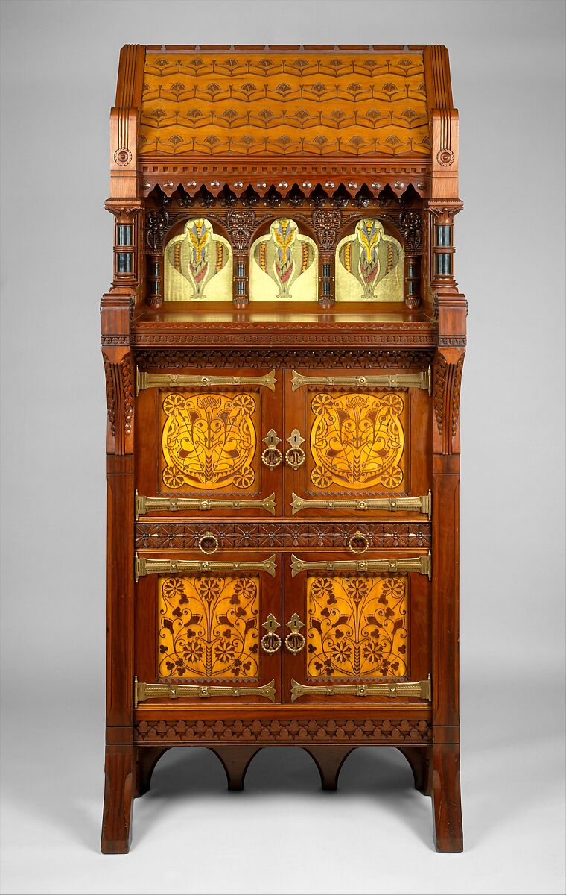

# Neural Network


Lastly, I conducted a neural network.
      
This neural network has three different layers, an Adam optimizer, 50 epochs, and a batch size of 5. 
```{r message=FALSE}
library(keras)
library(dplyr)
train_dat <- read.csv("train_dat_cleaned2.csv")
test_dat <- read.csv("test_dat_cleaned2.csv")

train_dat2 <- train_dat %>% select(-c(X.2, grp1, grp2, grp3, X, object.id))
test_dat2 <- test_dat %>% select(-c(X.2, grp1, grp2, grp3, X, object.id))

x_train <- as.matrix(train_dat2[, -which(names(train_dat2) == "is.highlightTrue")])
y_train <- as.matrix(train_dat2$is.highlightTrue)
x_test <- as.matrix(test_dat2[, -which(names(test_dat2) == "is.highlightTrue")])
y_test <- as.matrix(test_dat2$is.highlightTrue)

# Define the model architecture
model <- keras_model_sequential() %>% 
  layer_dense(units = 64, activation = "relu", input_shape = ncol(x_train)) %>% 
  layer_dense(units = 32, activation = "relu") %>% 
  layer_dense(units = 1, activation = "sigmoid")

# Compile the model with a loss function, optimizer, and metric
history <- model %>% compile(
  loss = "binary_crossentropy",
  optimizer = "adam",
  metrics = c("accuracy")
)

# Train the model on the training data
model %>% fit(
  x_train, y_train,
  validation_split = 0.2,
  epochs = 50,
  batch_size = 5
)


# Evaluate the model on the test data
metrics <- model %>% evaluate(x_test, y_test)

# Print the test accuracy
tr_metrics <- model %>% evaluate(x_train, y_train)

cat("Train accuracy:", tr_metrics["accuracy"], "\n")
cat("Test accuracy:", metrics["accuracy"], "\n")
```

The neural network, in this un-optimized form, did not result in a improvement in accuracy from the SVM. It performed very similarly to the random forest model in the training sets, yet the neural network did a much better job on the test set, compared to .72 on the test set for the random forest model. 

### To interpret this model, we will use Shapley Values: 

According to "9.6 SHAP (SHapley Additive exPlanations)" from our IML textbook (https://christophm.github.io/interpretable-ml-book/shap.html): 
      Shapley values are "The Shapley value, coined by Shapley (1953), is a method for assigning payouts to players depending on their contribution to the total payout. Players cooperate in a coalition and receive a certain profit from this cooperation". The math for SHAP is as follows: g(z')=\phi_0+\sum_{j=1}^M\phi_jz_j' where where g is the explanation model, z'\in\{0,1\}^M is the coalition vector, M is the maximum coalition size and \phi_j\in\mathbb{R} is the feature attribution for a feature j, the Shapley values. 

         
### Shapley Values for the First Line of the Test Dataset 
In this graph, we can see what is most important to the first artwork. 


```{r message=FALSE}
library(iml)
library(keras)

set.seed(2244)

shap_train <- train_dat2[, -which(names(train_dat2) == "is.highlightTrue")]
shap_test <- test_dat2[, -which(names(test_dat2) == "is.highlightTrue")]


mod <- Predictor$new(model, data = shap_train)
x.interest <- shap_test[1,]
shapley <- Shapley$new(mod, x.interest = x.interest)
plot(shapley, sort = TRUE)

```
The value of a shapley value is the average contribution of a feature value to the prediction in different coalitions. 
      
From this graph, we can tell the most important features in the determination of whether the first artwork in the test set is a highlight or not. This feature had a country, city, and dimensions. All of these factors helped the model determine the outcome. It did not have an artist bio, but it did not have geography.type. These factors contradicted the outcome. 

Spoiler! This artwork is a highlight. This means that for this artwork, it supported the models conclusion of a highlight because it had a value for a country, city, and dimensions. It hurt that conclusion when it had a value for the geography type and it did not have an artist bio. 
     
This makes a lot of sense. From this we can tell that the Met has much more extensive data on the highlighted works and their artists. This is unsurprising. The most famous artists in the Met are likely more well-studied and their data is referenced more often and, therefore, must be cleaner. 


        
### Shapley Values for full Test Set 

```{r message=FALSE}
library(iml)

mod <- Predictor$new(model, data = shap_train)
x.interest <- shap_test[c(1:744),]
shapley <- Shapley$new(mod, x.interest = x.interest)
shap_plot <- plot(shapley)

ggplotly(shap_plot)

```
          
This graph shows an average of the shapley values for all of the test set.
      
Interestingly, we can see what makes something more likely to be a highlight in the test set by the following qualities: 
- it is not in the Asian Art department 
- it is oil on canvas 
- it is not a print 
- it is not made by a French or American person

It is less likely to be a highlight because of these qualities: 
- it is not in the drawings and prints department 
- it doesn't have a country of origin, classification, or city listed
- it is not in the costume institute 
- it has no nationality listed
- it is not in the Egyptian Art, Costume Institute, European Decorative/Sculptural arts, or photographs department
- it is not a photograph or a painting

That is a lot of double negatives! Whew! 
In summary, it is more likely to be a highlight if it is not in the Asian Art department, it is oil on canvas, it has a stated culture, it is a painting, it has a nationality, it is not a print, and it was not made by a French or American person. 

        
```{r message=FALSE}
library(lime)

## works!
model_type.keras.engine.sequential.Sequential <- function(x, ...) {
  "classification"
}
predict_model.keras.engine.sequential.Sequential <- function (x, newdata, type, ...) {
  pred <- predict(object = x, x = as.matrix(newdata))
  data.frame (Positive = pred, Negative = 1 - pred) }

predict_model(x = model, 
               newdata = x_test, 
               type = 'raw') %>%
  tibble::as_tibble()

explainer <- lime::lime(x = as_tibble(x_train), 
                         model= model, 
                         bin_continuous = FALSE)

explanation <- lime::explain (
    as_tibble(x_test[c(2,366), ]), # Just to show first 10 cases
    explainer = explainer, 
    n_labels = 1,
    #labels    =  y_test[c(1,366), ], # explaining a `single class`(Polarity)
    n_features   = 10, # returns top 10 features critical to each case
    kernel_width = 0.5) 

plot_features (explanation) +
  labs (title = "LIME: Feature Importance Visualization",
        subtitle = "Hold Out (Test) Set, Object 200 and Object 322890")

```
In this LIME plot, we can inspect the ways that certain columns can impact the label of "positive" or "negative." For the first plot, we look at the first artwork in the test set. We can tell lack of the classification "Drawings and Prints" supports that it is a highlight. We actually already knew this from the Decision Tree. Having dimensions which this artwork does have, contradicts the fact that it is a highlight. Some objects, such as clothing pieces, do not have dimensions. 
    
Secondly, we see that a classification is a major feature in its importance. This makes sense because the Met probably has clean data for Van Goghs and Rembrandts and easily classified wroks might have made the category of work that it belongs in. 
      
Interestingly, the feature of Asian Art and Egyptian Art, as departments, did not support this label. Possibly because it is biased against Asian Art and towards Egyptian art. For case 2, we also found that "Drawings and prints" has a major effect, followed by dimensions, classification, photographs, drawings, Asian Art, and artist role. 

      
It feels wrong to talk about these art pieces without looking at them. So what artwork is the first one in the left lime explanation?  
```{r message=FALSE}
test_dat[2,]$object.id
df[which(df$object.id == "1083"),]

```
Yes, that's right! Daniel Pabst's cabinet. For reference, the website description continues as follows: "This Modern Gothic cabinet superbly demonstrates the influence of British reform theory on American design in the late nineteenth century. In form and decoration, it is indebted to the British architect Bruce J. Talbert, whose book "Gothic Forms Applied to Furniture, Metal Work, and Decoration for Domestic Purposes" (Birmingham, 1867; Boston, 1873) was influential in this country. A kinship with the work of the Philadelphia architect Frank Furness is also evident in the overall form of the cabinet, the verticality and shingled "roof" of which somewhat resemble Furness's bank buildings of the 1870s. The reverse-painted ribbed-glass panels are of a type Furness began to use on buildings as architectural decoration in 1876. Their stylized floral motif recalls the geometric plant forms of Christopher Dresser, a leading English ornamentist of the period who visited the Centennial Exhibition in Philadelphia in 1876 and whose published designs were well known in this country. Daniel Pabst, a leading manufacturer of artistic furniture in Philadelphia, probably executed the cabinet. A related cabinet, now in the Brooklyn Museum of Art, is documented to Pabst." 
        

```{r message=FALSE}
test_dat[366,]$object.id
df[which(df$object.id == "420178"),]
knitr::include_graphics("object.id420178.jpeg")

```
This object, which is not a highlight is a "Trade card from the "Fish from American Waters" series (N39), issued in 1889 in a set of 50 cards to promote Allen & Ginter brand cigarettes," according to the Met description. The first thing in the LIME explanation that contributes to its correct "non-highlight" classification is the fact that it is a drawing/print. 


```{r message=FALSE}
set.seed(2244)
vec <- sample(1:744, 20, replace = FALSE)

explanation <- lime::explain (
    as_tibble(x_test[vec, ]), # Just to show first 10 cases
    explainer    = explainer, 
    n_labels     = 1, # explaining a `single class`(Polarity)
    n_features   = 39, # returns top 10 features critical to each case
    kernel_width = 0.5) 

plot_explanations (explanation) +
  labs (title = "LIME Feature Importance Heatmap",
        subtitle = "Hold Out (Test) Set, 20 Random Cases Shown")
```
As a reminder, blue in the above graph means that the feature supports the above classification, while red means it contradicts the classification. 

From this explanations graph, we can see a combination of important of features based on feature weights from 20 random cases from the test set. 
- We can tell that classification as Drawings and Prints hurts the artwork;s chances of being a highlight. 
- We can also tell that a lack of dimensions or artist bio negatively affect the probability of the artwork being a highlight. 
- We also found that being in the Asian Art department or Egyptian Art department negatively affects the artwork's chance of being a highlight. 
- The only features that support the positivity of the "Highlight" variable are that the artist's role is "artist" and that the classification column is empty. 

         
Interestingly, the only departments that lack classification are the libraries, CostumeInstitute, and Egyptian Art. If we delineate by is.Highlight it makes a lot of sense to use an empty classification as a predictor because in all cases of empty classification, the libraries collection is a highlight. 
```{r message=FALSE}
table(df[which(df$classification == ""),]$department, df[which(df$classification == ""),]$is.highlight)
```

```{r message=FALSE}
empty_class <- df[which(df$classification == ""),]
empty_class[which(empty_class$department == "TheLibraries"),]$title[3]
```
From a Met archive search, these appear to be illustrations and other types of art in books. In the end, this lack of classification is likely a data error that merely needs to be resolved in the met archive. 
https://www.metmuseum.org/art/collection/search/591826 


References: 
- https://rstudio-pubs-static.s3.amazonaws.com/351198_33fe919a0364428bba3c848f4358fd5e.html


